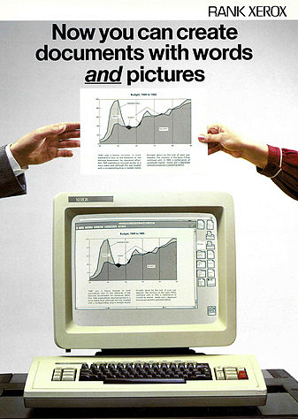
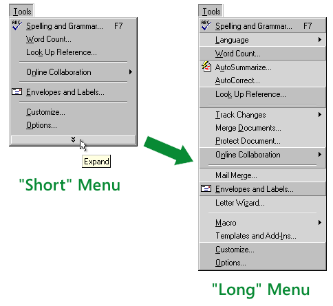
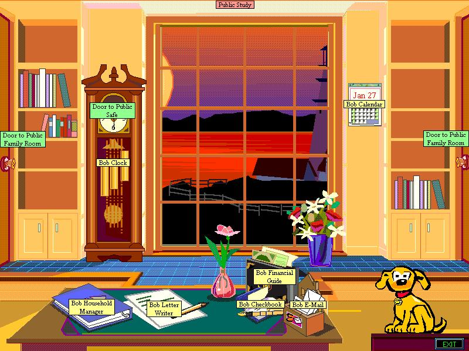

"Einstein's great work had sprung from physical intuition and when Einstein stopped creating, it was because he stopped thinking in concrete physical images and became manipulator of equations", Dyson

# Μοντέλα

Η αρχική αντίληψη που είχαν οι περισσότεροι για την διάδραση του υπολογιστή με τον άνθρωπο είναι ότι ο υπολογιστής είναι κυρίως ένα εργαλείο. Ενα εργαλείο που δημιουργήθηκε και χρησιμοποιείται από τον άνθρωπο για να βελτιώσει τις δραστηριότητες του σε διάφορους τομείς της ζωής του και κυρίως στην εργασία. Για παράδειγμα, στην διάδραση ανθρώπου-υπολογιστή μια από τις πιο δημοφιλείς εφαρμογές είναι η ψηφιακή επεξεργασία κειμένου. Στην επεξεργασία κειμένου ο ρόλος του υπολογιστή ως εργαλείου είναι η βελτίωση της εργασίας που παλιότερα γινόταν με το εργαλείο της γραφομηχανής, και ακόμη παλιότερα με την πένα. Στην πορεία όμως η ευελιξία που έχει ο υπολογιστής στην εκτέλεση διαφορετικών προγραμμάτων χρήστη και η εφεύρεση νεών στυλ διάδρασης, πέρα από την εισαγωγή κειμένου πάνω στο πληκτρολόγιο, επέτρεψαν στην διάδραση να έχει περισσότερους ρόλους πέρα από αυτόν του εργαλείου. Επιπλέον, τα νέα μοντέλα διάδρασης δίνουν μεγαλύτερη σημασία σε αξίες πέρα από την γνωστική επεξεργασία της πληροφορίας, όπως είναι τα συναισθήματα, η κοινωνική διάσταση, καθώς και η συνολική παρουσία του ανθρώπινου σώματος στον χώρο.

Καθώς προχωράμε σε νέα μοντέλα διάδρασης δεν σημαίνει ότι τα προηγούμενα βασικά μοντέλα της διάδρασης χάνονται. Αντίθετα, τα βασικά μοντέλα της διάδρασης συνεχίζουν να έχουν σημαντικό ρόλο ως συστατικά στοιχεία σε πιο σύνθετα συστήματα. Για παράδειγμα, ένα σύστημα συζήτησης εξ αποστάσεως έχει ως βασικό στοιχείο το *κοινωνικό μοντέλο διάδρασης* όπου ο υπολογιστής μεσολαβεί για την την επικοινωνία και συνεργασία δύο ή περισσότερων ανθρώπων, αλλά μπορεί να περιέχει και το *εργαλείο της ανάκτησης πληροφορίας* από παλιότερες συζητήσεις. Επιπλέον, το ίδιο σύστημα μπορεί να επεκταθεί με το *μοντέλο του πράκτορα διάδρασης*, ο οποίος παρακολουθεί τις συζητήσεις που γίνονται εκ μέρους του χρήστη και τον ενημερώνει όταν υπάρχει κάτι που τον ενδιαφέρει ή κάνει παρεμβάσεις εκ μέρους του. Επίσης, το παραπάνω σύστημα συνεργασίας μπορεί να επεκταθεί με την χρήση *διάχυτων συσκευών διάδρασης*, οι οποίες μπορούν να μεταφέρουν και την μη λεκτική επικοινωνία. Στα επόμενα περιγράφουμε την ιστορική εξέλιξη των μοντέλων διάδρασης καθώς και την θεωρία για καθένα ξεχωριστά, ενώ στο επόμενο κεφάλαιο θα δούμε την σύνθεση τους.

## Ιστορικό και πολιτισμικό πλαίσιο της φιλοσοφίας της διάδρασης

Αρχικά, τόσο οι πρώτοι κεντρικοί και μίκρο-υπολογιστές, όσο και ο επιτραπέζιος υπολογιστής θεωρήθηκαν ως ένα εργαλείο που διευκολύνει τις ανθρώπινες εργασίες. Για παράδειγμα ο υπολογιστής μπορούσε να βοηθήσει τον χρήστη στον υπολογισμό της τροχιάς ενός διαστημοπλοίου, στην σύνταξη μιας γραπτής αναφοράς, στην σχεδίαση μιας κατασκευής, στην επεξεργασία εικόνας, κτλ. Με την διάδοση του δικτύου Internet και την αύξηση της ισχύος (ταχύτητα, μνήμη, γραφικά) σε προσιτούς οικονομικά υπολογιστές αλλά και σε νέες μορφές (π.χ., φορητός, παιχνιδομηχανή, έξυπνο κινητό τηλέφωνο, κτλ) μια νέα γενιά εφαρμογών διάσκεδασης και επικοινωνίας ήρθε στο προσκήνιο, οι οποίες απαιτούσαν μια διαφορετιή θεώρηση της διάδρασης, πέρα από την χρησιμότητα και την ευχρηστία. Για παράδειγμα, οι ψυχαγωγικές εφαρμογές όπως τα βίντεο-παιχνίδια έχουν σκοπό να διασκεδάσουν τον χρήστη και σε πολλές περιπτώσεις ο στόχος είναι να δυσκολέψουν τον χρήστη παρά να τον διευκολύνουν, αφού αυτή η προσέγγιση (στις σωστές δόσεις) θα ενισχύσει την εμβύθηση στην ψυχαγωγική δραστηριότητα.

Ειδικά οι εφαρμογές επικοινωνίας μέσω υπολογιστή απέκτησαν μεγάλη σημασία τόσο στην εργασία (π.χ., email), όσο και στην καθημερινή ζωή (π.χ., forum συζητήσεων) και διασκέδαση (π.χ., online multiplayer games). Οι εφαρμογές επικοινωνίας και συνεργασίας μέσω του υπολογιστή είναι μια μεγάλη περιοχή την οποία ερευνά το πεδίο των κοινωνικών και συνεργατικών συστήματων.  Αυτό το βήμα συνοδεύτηκε από την ανάγκη για μια νέα θεώρηση της φιλοσοφίας της διάδρασης ως μέσο επικοινωνίας. Επιπλέον, η θεώρηση της διάδρασης ως μέσο επικοινωνίας δίνει έμφαση στην συμμετοχή των χρηστών στην παραγωγή περιεχομένου και υπηρεσιών, τα οποία κατά την δεκαετία του 2000 έγιναν ο κυρίαρχος τρόπος διάδρασης με τους υπολογιστές και ειδικά με το διαδίκτυο. Η σημασία των υπολογιστών ως μέσο επικοινωνίας γίνεται ακόμη πιο εμφανής κατά την δεκαετία του 2010, όταν το κοινωνικό δίκτυο Facebook καθώς και τα έξυπνα κινητά τηλέφωνα αντιπροσωπεύουν την πρώτη και πολλές φορές το μοναδικό σημείο επαφής των περισσότερων χρηστών με τους υπολογιστές.

Καθώς η χρήση του υπολογιστή ξέφυγε από το στενό πλαίσιο της εργασίας και την αντίληψη του ως απλό εργαλείο, όπου η απαίτηση για χρησιμότητα και ευχρηστία είναι κυρίαρχη, δημιουργήθηκε η ανάγκη για ένα νέο αξιακό σύστημα που βασίζεται περισσότερο στα συναισθήματα του ανθρώπου, καθώς και σε περισσότερες ανθρώπινες αισθήσεις. Τόσο οι ερευνητικές μελέτες όσο και τα εμπορικά προιόντα προς το τέλος της δεκαετίας του 2000 αρχίζουν να δίνουν έμφαση όχι μόνο στην γνωστική επεξεργασία της πληροφορίας αλλά και στα συναισθήματα του ανθρώπου, και αντίστοιχα η περιοχή της σχεδίασης της διάδρασης ανθρώπου-υπολογιστή αρχίζει να περιγράφεται και ως σχεδίαση της εμπειρίας του χρήστη. Με αυτόν τον τρόπο γίνεται ένα ακόμη βήμα μακρύτερα από την αρχική θεώρηση της περιοχής της διάδρασης που ήταν γνωστή ως σχεδίαση της διεπαφής ανθρώπου-υπολογιστή, όπου η διάδραση ήταν για παράδειγμα αντιληπτή ως η σχεδίαση των παραθύρων και των εικονιδίων, της γραφικής επιφάνειας εργασίας.

Επιπλέον, με την ανάπτυξη του κινητού και διάχυτου υπολογισμού, στις αρχές της δεκαετίας του 2000, η διάδραση έκανε το μεγάλο βήμα πέρα από το πλαίσιο της εργασίας και του γραφείου. Ειδικά για την περίπτωση του διάχυτου υπολογισμού, όπου έχουμε πολλούς υπολογιστές διαφόρων μορφών πάνω στον χρήστη ή στο περιβάλλον, η νέα θεώρηση της διάδρασης βασίστηκε στις φιλοσοφικές θεωρίες για την ενσάρκωση (embodiment), οι οποίες περιγράφουν την ανθρώπινη σκέψη, αντίληψη, και δράση ως στενά δεμένες με την ύπαρξη και τις ιδιότητες του ανθρώπινου σώματος. Οι υπολογιστές πλέον εκτός από την κινητή μορφή, μπορούν να φορεθούν και καταγράφουν βιομετρικά στοιχεία του χρήστη τους, όπως κινήσεις και σφυγμό. Παράλληλα με την σταδιακή έμφαση στην συνολική φύση του ανθρώπου, μια μεγάλη μερίδα του επιστημονικού και εμπορικού κόσμου συνεχίζει να αναζητεί την χρησιμότητα του υπολογιστή στον αυτοματισμό, όπου η διάδραση γίνεται αντιληπτή ως επικοινωνία με έναν έξυπνο βοηθό.

## Ο Υπολογιστής ως Εργαλείο

Η αντίληψη του υπολογιστή ως εργαλείο ήταν η κυρίαρχη αντίληψη στα πρώτα στάδια του επιτραπέζιου υπολογιστή και παραμένει μια ισχυρή αντίληψη για την λειτουργία του υπολογιστή σε πλαίσια δραστηριότητας όπως είναι η εργασία. Για παράδειγμα, ο επεξεργαστής κειμένου επιτρέπει στον χρήστη να προετοιμάσει ένα κείμενο σε ψηφιακή μορφή, η οποία είναι περισσότερο ευέλικτη στις αλλαγές, στην αποθήκευση, και στην μεταφορά σε αντίθεση με την φυσική σελίδα που τυπώνεται από μια παραδοσιακή γραφομηχανή ή που γράφεται με ένα μολύβι. Φυσικά υπάρχουν και περισσότερο σύνθετες περιπτώσεις όπου πολλά εργαλεία συμπληρώνουν το ένα το άλλο για να επιτελέσουν μια περισσότερο πολύπλοκη δραστηριότητα. Για παράδειγμα, ο προγραμματισμός υπολογιστών βασίζεται συνήθως στην χρήση ενός απλού επεξεργαστή κειμένου και μιας σειράς από βοηθητικά προγράμματα υπολογιστή που βοηθάνε στην προετοιμάσια, στον έλεγχο, και στην τελική εκτέλεση του νέου προγράμματος. Ο προγραμματιστής του υπολογιστή αντιλαμβάνεται και χρησιμοποιεί τα παραπάνω ως εργαλεία για να κάνει την δουλειά του που είναι η κατασκευή ή επισκευή ενός προγράμματος στον υπολογιστή.

Η πρωταρχική και για πολλά χρόνια κυρίαρχη αντίληψη του υπολογιστή ως εργαλείου μπορεί να εντοπιστεί στα πρώτα στάδια της δημιουργίας και εξέλιξης της γραφικής επιτραπέζιας επιφάνειας εργασίας από την ερευνητική ομάδα του Xerox PARC. Η ανθρωποκεντρική μελέτη των διεργασιών του χρήστη βασίστηκε στην παρατήρηση, στις συνεντεύξεις, και στην ανάλυση της εργασίας που πραγματοποιείται στους εκδοτικούς οργανισμούς, οι οποίοι είναι οι βασικοί πελάτες της εταιρείας Xerox κατά την δεκαετία του 1970. Οι διεργασίες που εκτελεί αυτή η πολύ καλά ορισμένη ομάδα χρηστών (π.χ., γλωσσική επιμέλεια, γραφικά, σελιδοποίηση, διαχείρηση της παραγωγή του εντύπου) απότελεσαν το σημείο αναφοράς για τον προγραμματισμό της διάδρασης, ο οποίος οργανώθηκε πάνω στην γραφική επιφάνεια εργασίας (π.χ., φάκελοι, εργαλεία, καλάθι αχρήστων, κτλ), ως βασική μεταφορά της διεργασίας που κάνουν οι χρήστες. Αν και η επιφάνεια εργασίας αποδείχθηκε στην πορεία εξαιρετικά ευέλικτη και προσαρμόσιμη στις τεχνολογικές εξελίξεις, ταυτόχρονα αυτό το αρχικό πλαίσιο δημιουργίας της ως εργαλείο για εκδοτικές εργασίες παρέμεινε βασικός περιορισμός που δημιουργεί την ανάγκη για μια διαφορετική αντίληψη του προγραμματισμού της διάδρασης, τουλάχιστον σε διαφορετικά πλαίσια ανθρώπινης δραστηριότητας (π.χ., ψυχαγωγία).

Εκτός από την διεργασία της προετοιμασίας και της σελιδοποίησης μιας γραπτής αναφοράς που γίνεται τόσο από ερασιτέχνες όσο και επαγγελαματίες χρήστες, μια ακόμη δημοφιλής εφαρμογή της διάδρασης είναι η διαδικασία της σχεδίασης που εφαρμόζουν οι μηχανικοί. Από τις αρχές τις δεκαετίας του 1980 όλες οι κατηγορίες των μηχανικών άρχισαν να χρησιμοποιούν τον υπολογιστή στην θέση του σχεδιαστηρίου για να ετοιμάσουν κτήρια, δρόμους, γέφυρες, αεροσκάφη, μηχανές, αντικείμενα, και ηλεκτρικά κυκλώματα. Στην πράξη η σχεδίαση με υπολογιστή είναι πολύ πιο αποδοτική ειδικά κατά την σχεδίαση αντικειμένων τα οποία είναι παρόμοια με υπάρχοντα ή περιέχουν κάποια κοινά μοτίβα με αυτά. Επιπλέον, το βασικό πλεονέκτημα ότι επιτρέπει την γρήγορη αναίρεση και εξερεύνηση εναλλακτικών κατευθύνσεων. Επίσης, ένα ακόμη πλεονέκτημα της διαδραστικής σχεδίασης είναι ότι επιτρέπει την εύκολη αποθήκευση και διαμοιρασμό, τα οποία είναι απαραίτητα στις περισσότερες συνεργατικές δραστηριότητες σχεδίασης. Από την άλλη πλευρά, από την στιγμή που η διαδραστική σχεδίαση λειτουργεί μόνο στο στενό και καλά ορισμένο πλαίσιο ενός προγράμματος διάδρασης στον υπολογιστή, δυσκολεύει την σχεδίαση αντικειμένων που δεν υπάρχουν. Με άλλα λόγια είναι ένα περιοριστικό εργαλείο αυτοσχεδιασμού και φαντασίας, τουλάχιστον σε σχέση με το μολύβι και το χαρτί, τουλάχιστον στα χέρια του έμπειρου χρήστη.

Η εμπορική σημασία του υπολογιστή ως εργαλείου φαίνεται στην περίπτωση του ηλεκτρονικού εμπορίου, το οποίο σε πολύ μικρό χρονικό διάστημα άλλαξε την μορφή της πώλησης και τις διανομής για πολλές κατηγορίες τυποποιημένων προϊότων και κυρίως υπηρεσιών. Η πανάρχαια διαδικασία της μετάβασης στην τοποθεσίας της αγοράς για την προμήθεια προϊόντων και υπηρεσιών μετασχηματίζεται σε μια διαδραστική εμπειρία στον υπολογιστή. Ο υπολογιστής λειτουργεί ως εργαλείο επιλογής προϊόντος καθώς και ως εργαλείο πληρωμής, το οποίο μειώνει την σημασία του τυπωμένου χρήματος, αφού η συναλλαγή πραγματοποιείται λογιστικά ανάμεσα στον λογαριασμό του προμηθευτή και του πελάτη. Η προτίμηση των χρηστών για αυτήν την μορφή αγοράς και χρηματικής συναλλαγής δημιουργεί μια σειρά από επιπτώσεις που είναι πρωτοφανείς. Ειδικά για την περίπτωση κάποιων υπηρεσιών (π.χ., αεροπορικά εισιτήρια, ξενοδοχεία, ψυχαγωγικό περιεχόμενο όπως μουσική, ταινίες, παιχνίδια) όπου δεν απαιτείται η μεταφορά κάποιου απτού προϊόντος, η μετάβαση στο ηλεκτρονικό εμπόριο ήταν καθολική αφού ήταν πιο αποτελεσματικό τόσο για τους χρήστες όσο και για τους πάροχους της υπηρεσίας, με αποτέλεσμα την καταστροφή πολλών επιμέρους ενδιάμεσων (π.χ., δισκοπωλεία, τουριστικοί πράκτορες, κτλ). Επομένως, βλέπουμε ότι η χρήση του υπολογιστή ως εργαλείο μπορεί να είναι μια απλή βελτιστοποίηση μιας διεργασίας που ήδη κάνουμε (π.χ., συγγραφή κειμένου), αλλά μπορεί και να έχει σημαντικές επιπτώσεις σε επαγγέλματα και ανθρώπινες δραστηριότητες που παύουν να υπάρχουν, γιατί δεν χρειάζονται πλεόν, αφού γίνονται πολύ καλύτερα κατά τον προγραμματισμό της διάδρασης ανθρώπου-υπολογιστή (π.χ., αγορά αεροπορικού εισιτηρίου).

![Η δημιουργία πανοραμικών φωτογραφιών ήταν μια σχετικά δύσκολη διαδικασία ειδικά για την παραδοσιακή φωτογραφία, αλλά και για την ψηφιακή αφού έπρεπε να γίνουν ξεχωριστά αλλά συντονισμένα βήματα σε διαφορετικές χρονικές στιγμές, μέχρι που τα έξυπνα κινητά έδωσαν την δυνατότητα της επιτόπου εκτέλεσης μιας διαδραστικής εφαρμογής που διευκολύνει τον χρήστη στην δημιουργία της πανοραμικής φωτογραφίας απευθείας πάνω στην συσκευή του χάριν στην χρήση του αισθητήρα κίνησης καθώς και χάριν στις δυνατότητες απεικόνισης και υπολογισμού.](../images/ch05/panorama.png)

Η αντίληψη του υπολογιστή ως εργαλείο συνεχίζει να παραμένει κυρίαρχη και στην εποχή της μετάβασης από τον επιτραπέζιο, στον κινητό και διάχυτο υπολογισμό. Για παράδειγμα, ένα έξυπνο κινητό τηλέφωνο συνοδεύεται συνήθως από μια ψηφιακή φωτογραφική μηχανή, η οποία είναι ένα εργαλείο για την αποτύπωση εικόνων. Οι ψηφιακές φωτογραφικές μηχανές των έξυπνων κινητών τηλεφώνων επικράτησαν γιατί εκτός από την οικειότητα στην χρήση των βασικών λειτουργιών και την δυνατότητα να τις έχουμε πάντα μαζί μας, παρέχουν και μια σειρά από επιπλέον λειτουργείες χάριν στις δυνατότητες που έχει το έξυπνο κινητό τηλέφωνο (π.χ., αισθητήρας θέσης, κίνησης, φίλτρα, δικτύωση, κτλ), οι οποίες κάνουν την ενσωματωμένη φωτογραφική μηχανή ακόμη πιο χρήσιμη και εύχρηστη (π.χ., δημιουργία πανοραμικής φωτογραφίας). Παρόμοια με τα κινητά τηλέφωνα που περιέχουν και φωτογραφική μηχανή, οι φορετοί υπολογιστές όπως τα έξυπνα ρολόγια περιέχουν αισθητήρες κίνησης και βιομετρικών στοιχείων, οπότε μετατρέπουν ένα εργαλείο που αρχικά έδινε ρυθμό με βάση τον κοινά αποδεκτό χρόνο της γης, σε ένα εργαλείο που μετράει περισσότερες παραμέτρους και μπορεί να δώσει ρυθμό με βάση το αξιακό σύστημα (π.χ., ώρες ύπνου, βήματα, κτλ) του κάθε ανρθώπου χωριστά. Συμπερασματικά, η αντίληψη του υπολογιστή ως εργαλείο παραμένει εξίσου αν όχι περισσότερο δημοφιλής από ποτέ καθώς ο υπολογιστής διαχέεται σε όλο και περισσότερες ανρθώπινες δραστηριότητες. Ταυτόχρονα όμως ο υπολογιστής αποκτάει νέους ρόλους πέρα από απλό εργαλείο, όπως είναι ένα μέσο επικοινωνίας, το οποίο ίσως να είναι και περισσότερο σημαντικό, από την πλευρά του ανθρώπου.

## Ο Υπολογιστής ως Μέσο Επικοινωνίας

Οι καλιτέχνες ήταν από τους πρώτους που χρησιμοποίησαν τον υπολογιστή ως εργαλείο για να δημιουργήσουν καλλιτεχνικά έργα, όμως η πιο σημαντική συνεισφορά τους έγινε όταν οι καλιτέχνες χρησιμοποίησαν τον υπολογιστή ως μέσο για το έργο τους. Για παράδειγμα, η Brenda Laurel με ένα υπόβαθρο σε θεατρικές σπουδές τονίζει την δυνατότητα των υπολογιστών να λειτουργήσουν ως μια σκηνή όπου οι χρήστες μπορούν να παίζουν ρόλους και να αυτοσχεδιάζουν. Αυτή η αντίληψη έρχεται να συμπληρώσει την αντίληψη του υπολογιστή ως εργαλείο, το οποίο συνήθως σχεδιάζεται με στόχο να ικανοποιήσει ανθρώπινες ανάγκες και δραστηριότητες που είναι καλά ορισμένες. Για παράδειγμα, ο Myron Kruger στα μέσα της δεκαετίας του 1970 προγραμμάτισε για πρώτη φορά την διάδραση ανθρώπου-υπολογιστή με έμφαση στην παρουσία του ανθρώπινου σώματος. Με αυτόν τον τρόπο, η κατανόηση της διάδρασης με τον υπολογιστή απελευθερώνεται από την μέχρι τότε αντίληψη της ως ένα απλό εργαλείο και αρχίζει να γίνει αντιληπτή ως ένα μέσο επικοινωνίας που συνδέει τους ανθρώπους μεταξύ τους και με την πληροφορία που μπορούμε να αναπαραστήσουμε στον υπολογιστή.

Η αρχική αντίληψη που έχουν οι περισσότεροι για την διάδραση, (και η οποία στην συνέχεια καθορίζει έμεσα μια σειρά από άλλες αντιλήψεις και σχεδιαστικές επιλογές), είναι αυτή της ένα-προς-ένα επικοινωνίας ανάμεσα σε άνθρωπο και υπολογιστή. Αν και η ένα προς ένα διάδραση ανθρώπου-υπολογιστή αποτελεί βασικό συστατικό κάθε σύνθετης μορφής διάδρασης δεν βρίσκεται πάντα στο επίκεντρο του ενδιαφέροντος. Στον επιτραπέζιο υπολογιστή όπου έχουμε ένα πληκτρολόγιο και ένα ποντίκι η διάδραση ανάμεσα στον άνθρωπο και τον υπολογιστή είναι ένα προς ένα και σε αυτό το πλαίσιο έχει δημιουργηθεί και ωριμάσει η περιοχή της διάδρασης ανθρώπου-υπολογιστή. Καθώς όμως οι υπολογιστές άρχισαν να δικτυώνονται είτε στον ίδιο χώρο, είτε ανάμεσα σε μεγάλες γεωγραφικές αποστάσεις και διαφορετικές χρονικές ζώνες, δημιουργήθηκε η ανάγκη να μελετήσουμε και να προγραμματίσουμε την διάδραση που συμβαίνει ανάμεσα σε ανθρώπους που συνεργάζονται από απόσταση, σε διάφορους τομείς όπως η εργασία, η διασκέδαση, η εκπαίδευση, και η καθημερινή ζωή.

Τα συνεργατικά συστήματα έγιναν γνωστά ως επιστημονική περιοχή στα τέλη της δεκαετίας του 1980, αλλά η συνεργασία και η επικοινωνία μέσω του υπολογιστή είχε ήδη ξεκινήσει. Στα τέλη της δεκαετίας του 1970, η μεγάλη διάδοση των πρώτων οικονομικών προσωπικών υπολογιστών και των μόντεμ που επέτρεπαν την ψηφιακή μεταδοση δεδομένων μέσα από τις αναλογικές τηλεφωνικές γραμμές, δημιούργησε τα πρώτα Bulletin Board Systems (BBS). Τα BBS ήταν ένα είδος φόρουμ, όπου οι χρήστες μπορούσαν να συζητήσουν σύγχρονα ή ασύγχρονα, να βγάλουν ανακοινώσεις, και να μοιραστούν αρχεία. Παράλληλα, αντίστοιχα συστήματα συνεργατικού λογισμικού βασισμένα σε μικρο-υπολογιστές (micro-computers) και κεντρικούς υπολογιστές (mainframe) είχαν αναπτυχθεί για εταιρείες με σκοπό την διευκόλυνση της συνεργασίας.

Η περιοχή του συνεργασίας ανθρώπων μέσω υπολογιστών θεωρείται ο πρώτος και ίσως ο πιο σημαντικός συγγενής της περιοχής Διάδραση Ανθρώπου-Υπολογιστή. Επομένως, ένα μεγάλο μέρος από την θεωρία, τις μεθόδους, και τις τεχνικές είναι κοινές ή τουλάχιστον παρόμοιες. Υπάρχει όμως και τουλάχιστον μια σημαντική διαφορά που επιβάλει την αντιμέτωση των Κοινωνικών και Συνεργατικών Συστήματων σε μια ξεχωριστή περιποχή: Στην διάδραση ανθρώπου-υπολογιστή συνήθως εστιάζουμε την προσοχή μας (προγραμματισμός, αξιολόγηση) στην διάδραση που συμβαίνει ανάμεσα σε έναν άνθρωπο και ένα υπολογιστή, όμως στα Κοινωνικά και Συνεργατικά Συστήματα η βασική μονάδα ανάλυσης είναι η διάδραση ανάμεσα σε μια ομάδα (τουλάχιστον δύο) ανθρώπων, η οποία συμβαίνει διαμέσου ενός τουλάχιστον υπολογιστή. Το πιο απλό και δημοφιλές παράδειγμα για την περιοχή των Συνεργατικών Συστημάτων είναι το Facebook, ένα σύστημα που επιτρέπει την επικοινωνία και συνεργασία ομάδων ανθρώπων.

Η σημασία των κοινωνικών και συνεργατικών συστημάτων πέρασε από τις εταιρείες στην ευρύτερη κοινωνία και από την εργασία στην καθημερινότητα με την ανάπτυξη των κοινωνικών δικτύων μετά τα μισά της δεκαετίας του 2000. Εκείνη την περίοδο δημιουργήθηκαν πολλά κοινωνικά δίκτυα, όπου ο κάθε χρήστης περιέγραφε την προσωπικότητα και τις προτιμήσεις του και έκανε εικονικούς δεσμούς φιλίας με άλλους χρήστες. Ανάμεσα στα πολλά κοινωνικά δίκτυα, το Facebook ήταν αυτό που γνώρισε την μεγαλύτερη αποδοχή με περισσότερο από ένα δισεκατομυρία εγγεγραμμένους χρήστες στις αρχές της δεκαετίας του 2010. Οι βασικές δραστηριότητες που κάνουν οι χρήστες του Facebook είναι να ενημερώνουν την τρέχουσα κατάσταση τους, να συζητάνε δημόσια ή ιδιωτικά, και να κάνουν ανάρτηση φωτογραφιών. Καθώς η μεγάλη δραστηριότητα του διαδικτύου πέρασε από την υπηρεσία του ιστού και την ανάρτηση ιστοσελίδων στα δίκτυα κοινωνικής δικτύωσης, αντίστοιχα παρατηρούμε και μια μετατόπιση στο είδος της διάδρασης των νέων εφαρμογών, οι οποίες επιβάλεται πλέον να έχουν και μια κοινωνική διάσταση.

## Ο Υπολογιστής ως Εταίρος

Η αντίληψη του υπολογιστή ως μια έξυπνη και αυτόνομη οντότητα εμφανίστηκε για πρώτη φορά στην λογοτεχνία και τις ταινίες της επιστημονικής φαντασίας, όπου οι δημιουργοί φαντάζονται έναν υπολογιστή με ανθρώπινα στοιχεία διάδρασης. Αυτός ο ανθρωπομορφισμός της διάδρασης ανθρώπου-υπολογιστή μπορεί να έχει διάφορες μορφές ή χαρακτηριστικά που συνδέουμε με την ανθρώπινη παρουσία, όπως πρόσωπο, ομιλία, σώμα, συναίσθημα, κοινή λογική. Η περιοχή της Τεχνητής Νοημοσύνης προσπάθησε να δώσει πρακτικές λύσεις στα παραπάνω, αλλά τα αποτελέσματα έχουν μόνο πολύ στενή χρησιμότητα και σε πολύ καλά ορισμένες εφαρμογές. Για παράδειγμα, η αναγνώριση γραφής και ομιλίας είναι πλέον εμπορικά διαθέσιμη μετά από περισσότερο από 40 χρόνια έρευνας και αποτυχημένων εμπορικών προϊόντων, αλλά στην πράξη δεν είναι όσο χρήσιμη την φαντάστηκαν οι δημιουργοί της επιστημονικής φαντασίας, ούτε τόσο πρακτική όσο την σχεδίασαν οι επιστήμονες της Τεχνητής Νοημοσύνης, αφού στις περισσότερες περιπτώσεις η διάδραση γίνεται συσκευές εισόδου και επιπλέον διεπαφές που πρέπει να μάθει ο χρήστης.

Ο αυτοματισμός είναι μια εκδοχή της διάδρασης ανθρώπου-υπολογιστή, όπου οι ενέργειες του χρήστη, η διεπαφή του υπολογιστή, ή ακόμη και οι ανάγκες του χρήστη εξάγονται δυναμικά από τον υπολογιστή, ο οποίος μπορεί επιπλέον να λαμβάνει αποφάσεις με βάση κανόνες. Ο αυτοματισμός που προσφέρει ένας υπολογιστής μπορεί να διευκολύνει και την διάδραση με τον άνθρωπο. Για παράδειγμα, μια λίστα με εφαρμογές μπορεί να ταξινομηθεί ανάλογα με ποιές χρησιμοποιούμε περισσότερο συχνά. Φυσικά, αυτό σημαίνει ότι το αντίστοιχο μενού θα είναι πιθανόν διαφορετικό καθέ φορά που το ζητάει ο χρήστης, πράγμα που πιθανόν να δημιουργεί εκτός από διευκόλυνση και μια ασυνέπεια απέναντι στην συνήθεια να βρίσκουμε τα πράγματα εκεί που τα αφήσαμε. Αν και ο αυτοματισμός έχει αποδειχτεί πολύ χρήσιμος σε πολλές εφαρμογές των υπολογιστών, στην περίπτωση της διάδρασης η χρήση του αυτοματισμού θέλει προσοχή, κυρίως γιατί θα πρέπει να αξιολογηθεί απέναντι στον χρήστη και όχι μόνο απέναντι σε κάποιες λειτουργικές και φαινομενικά αντικειμενικές προδιαγραφές.

Ταυτόχρονα με τους ερευνητές της Τεχνητής Νοημοσύνης που προσπαθούν να κωδικοποιήσουν την ανθρώπινη λογική και συμπεριφορά σε έναν υπολογιστή, οι ερευνητές της Ανθρώπινης Επικοινωνίας διαπιστώνουν ότι στην πράξη οι ανθρώπινες αντιδράσεις κατά την διάδραση με υπολογιστές και μέσα επικοινωνίας δεν έχουν διαφορά από τις αντιδράσεις κατά την διάδραση με άλλους ανθρώπους και φυσικά αντικείμενα. Η διαπίστωση αυτή δημιούργησε μια σειρά από ερευνητικές και εμπορικές προσπάθειες στην κατεύθυνση του ανθρωπομορφισμού και του σκευομορφισμού κατά τον προγραμματισμό της διάδρασης. Το αρχικό κίνητρο σε όλες αυτές τις προσπάθειες είναι η δημιουργία μιας περισσότερο οικείας και "φιλικής" διάδρασης με τον άνθρωπο. Στην πορεία, η "φιλική διεπαφή" της δεκαετίας του 1990 έδωσε την θέση της στην "πειστική διεπάφη" της δεκαετίας του 2000, όταν οι σχεδιαστές προσπάθησαν να δημιουργήσουν διεπαφές που θα βοηθούσαν τους χρήστες να αλλάξουν συμπεριφορά. Για παράδειγμα, μια εφαρμογή καταγραφής των βημάτων και της απόστασης που κάνουμε πεζοί κάθε μέρα, εκτός από μια απλή στατιστική αποτύπωση των επιδόσεων μας, μπορεί να περιέχει και μια ανθρωπόμορφη διεπαφή η οποία μας παροτρύνει, ή ακόμη και επικρίνει (ανάλογα με το ψυχολογικό προφίλ του αντίστοιχου χρήστη), ανάλογα με τις επιδόσεις, έτσι ακριβώς όπως θα έκανε ένας φίλος ή ο προσωπικός γυμναστής.

Ισως μια από τις πιο αποτυχημενές εισαγωγές νέου προϊόντος διάδρασης ανθρώπου-υπολογιστή ήταν το Microsoft Bob καθώς και το σχετικό Microsoft Office Clip, τα οποία ήταν μια προσπάθεια της Microsoft να δώσει μια περισσότερη "φιλική" διάδραση στις εφαρμογές της. Αν και η ιδέα του ανθρωπομορφισμού βασιζόταν σε πολυετή επιστημονική έρευνα και ενώ είχαν γίνει πολλές δοκιμές με τους χρήστες στα αρχικά στάδια του προϊόντος τελικά η αποδοχή από το ευρύ κοινό ήταν από μικρή έως αρνητική. Εκ των υστέρων, μια πιθανή εξήγηση είναι ότι τουλάχιστον στην δεκαετία του 1990 οι περισσότεροι επιτραπέζιοι υπολογιστές ήταν ακόμη για εργασία και η "φιλικότητα" δεν ήταν υψιλής προτεραιότητας για τους χρήστες, ενώ μπορεί να τους φαινόταν ακόμη και ενοχλητικοί όταν προσπαθούσαν να συγκεντρωθούν για να γράψουν μια εργασία στον επεξεργαστή κειμένου και ξαφνικά τους έπιανε κουβέντα ένας σκύλος στην οθόνη του τερματικού τους! Σε μια δεύτερη ανάγνωση, η ιστορία του Microsoft Bob είναι και μια προειδοποίηση ότι οι τεχνικές τις ανθρωποκεντρικής σχεδίασης δεν είναι ασφαλείς, όχι τόσο γιατί δεν είναι σωστές σαν τεχνικές, αλλά περισσότερο γιατί έχουν ως στόχο να ικανοποιήσουν ανθρώπινες ανάγκες που είναι από ασαφείς μέχρι ρευστές.

Οι έξυπνοι πράκτορες είναι μια αυτοματοποιημένη εκδοχή της διάδρασης με τον υπολογιστή. Ενας τρόπος να οριστούν οι έξυπνοι πράκτορες είναι ως το συμπλήρωμα του απευθείας χειρισμού. Οπως δηλαδή έχουμε τον απευθείας χειρισμό για να εκτελέσουμε μια διεργασία στον υπολογιστή, έχουμε τους έξυπνους πράκτορες που μπορούν να εκτελέσουν αυτήν την διεργασία για λογαριασμό μας. Απο την μια πλευρά ο απευθείας χειρισμός δείνει στον χρήστη την δυνατότητα πάρει αποφάσεις, αλλά από την άλλη πλευρά υπάρχει ένα όριο στην πληροφορία που μπορεί να επεξεργαστεί ο χρήστης, ενώ σίγουρα υπάρχουν πολλές αποφάσεις που είναι παρόμοιες ή τουλάχιστον έχουν κάποιες ιδιότητες που είναι παρόμοιες, άρα θα μπορούσαν να λαμβάνονται από έναν έξυπνο πράκτορα που εκπροσωπεί τον χρήστη. Αν και σε πρώτη ανάγνωση φαίνεται πως οι έξυπνοι πράκτορες είναι το αντίθετο του απευθείας χειρισμού είναι περισσότερο γόνιμο να τα αντιμετωπίζουμε ως συμπληρωματικά.Για παράδειγμα ο χρήστης με απευθείας χειρισμό δείχνει στον υπολογιστή ότι κάποια από τα ηλεκτρονικά μηνύματα του είναι άχρηστα, ενώ κάποια άλλα είναι για την εργασία του, έτσι ο έξυπνος πράκτορας την επόμενη φορά που θα δει ένα μήνυμα θα μπορέσει να το μεταφέρει στον σωστό φάκελο χωρίς επιμέρους ενέργεια από την πλευρά του χρήστη. Στην πράξη αυτα τα συστήματα έχουν βελτιωθεί πάρα πολύ και στις περισσότερες περιπτώσεις κάνουν λιγότερα λάθη από έναν άνθρωπο, όμως σε κάθε περίπτωση τα όποια λάθη κάνουν δεν έχουν ευθύνη, πράγμα που μπορεί να είναι σε σημαντικό σε κάποιες εφαρμογές.

[Οι πρώτες εκδόσεις του δημοφιλούς iOS είχαν πολλές εφαρμογές που έμοιαζαν οπτικά με τα αντίστοιχα αντικείμενα του πραγματικού κόσμου, αλλά στην πορεία άλλαξαν προς περισσότερο αφαιρετικές αναπαραστάσεις οι οποίες συνήθως είναι και περισσότερο λειτουργικές υπό την προυπόθεση ότι ο χρήστης δεν είναι αρχάριος](../images/ch05/ical.png)

Οταν η μεταφορά γίνεται ιδιαίτερα αναπαραστατική σε ένα γραφικό περιβάλλον τότε  μιλάμε για σκευομορφισμό, όπως για παράδειγμα πολλές εφαρμογές στις πρώτες εκδόσεις του iphone, οι οποίες μοιάζουν με αντίστοιχα αντικείμενα ή προσομοιώνουν οπτικά τα αντίστοιχα υλικά, π.χ., μέταλο, ύφασμα, κτλ. Αν και το αρχικό iPhone (iOS) ήταν από τις πιο δημοφιλείς συσκευές με τεχνικές σκευομορφισμού στην έξοδο με τον χρήστη, σίγουρα δεν ήταν η πρώτη. Στην δεκαετία του 1990, η σταδιακή μετατροπή και διανομή της μουσικής με συμπιεσμένα αρχεία τύπου MP3 δημιούργησε την ανάγκη για ευέλικτες εφαρμογές εκτέλεσης των αρχείων MP3 στον υπολογιστή και ανάμεσα σε αυτές οι πιο δημοφιλείς ήταν εκείνες που επέτρεπαν στον χρήστη να αλλάξει την μορφή της εφαρμογής (skinning), με πιο αντιπροσωπευτικό παράδειγμα την εφαρμογή Winamp. Η χρήση της μεταφοράς και του σκευομορφισμού δεν έχει από μόνη της πάντα θετικά αποτελέσματα. Για παράδειγμα, στις αρχές της δεκαετίας του 1990 το λειτουργικό σύστημα Magic Cap για τον κινητό υπολογισμό εμφανίζουν στην οθόνη ένα γραφείο με τα αντίστοιχα οικεία αντικείμενα πάνω στο γραφείο, όπως είναι το τηλέφωνο-φάξ, το  ημερολογίο, το σημειωματάριο, η λίστα επαφών (rolodex), τα εισερχόμενα/εξερχόμενα, το αρχείο, κτλ. Η χρήση της μεταφοράς στην περίπτωση του Magic Cap δεν σταματούσε στο γραφείο, αλλά συνέχιζε με την μετακίνηση του χρήστη ανάμεσα σε δωμάτια στα οποία είχε πρόσβαση σε διαφορετικές λειτουργίες. Αν και είναι δύσκολο έως αδύνατο να διακρίνουμε τα προβλήματα, καμία από τις παραπάνω μορφές της διεπαφής με τον χρήστη δεν είχαν αποδοχή από τους χρήστες, αν και εφάρμοζαν κάποιους από τους κανόνες της "φιλικής" για τον άνθρωπο σχεδίασης, όπως είναι η μεταφορά και ο σκευομορφισμός.

# Ερευνητική Μελέτη Περίπτωσης

Η αρχική θεωρητική θεμελίωση της περιοχής της διάδρασης ανθρώπου-υπολογιστή βασίστηκε στην τρέχουσα για την εποχή αντίληψη της διάδρασης που με την σειρά της βασιζόταν στον επιτραπέζιο υπολογιστή, στην γραφική επιφάνεια εργασίας, και στο πλαίσιο των εφαρμογών γραφείου και παραγωγικότητας. Αντίστοιχα, η αρχική θεώρηση της διάδρασης έδωσε έμφαση στην επεξεργασία της πληροφορίας από τον άνθρωπο, καθώς και στον έλεγχο και απεικόνιση της στο τερματικό του χρήστη. Οι θεμελιωτές της αρχικής θεωρίας προσπάθησαν να δημιουργήσουν ένα αναλυτικό πλαίσιο, καθώς και τα αντίστοιχα μοντέλα για τον τρόπο που ο άνθρωπος αντιλαμβάνεται, επεξεργάζεται, και ελέγχει την πληροφορία. Σε ορισμένες περιπτώσεις η αναλυτική αυτή προσέγκιση είχε άριστα και διαχρονικά αποτελέσματα, όπως στην πρόβλεψη της απόδοσης της συσκευής εισόδου ποντίκι.

Από την άλλη πλευρά όμως, καθώς περάσαμε στον κινητό και διάχυτο υπολογιστή και καθώς οι υπολογιστές έγιναν μέρος δραστηριοτήτων πέρα από την παραγωγικότητα, η ποιότητα της διάδρασης άρχισε να αποκτά και άλλες διαστάσεις πέρα από την βασική ευχρηστία. Στα τέλη τις δεκαετίας του 1990, μια σειρά από πειράματα διάδρασης με διεπαφές που είχαν μεταξύ τους διαφορές μόνο στην αισθητική και όχι στην ευχρηστία τους, οδήγησε στο συμπέρασμα ότι η ευχρηστία δεν είναι ο μόνος παράγοντας που καθορίζει την αποδοχή μιας διεπαφής. Τα πειράματα έγιναν με πολλές διαφορετικές διεπαφές όπως τραπεζικά ATM, μουσικές συσκευές, συστήματα προσομοίωσης βιομηχανικών διαδικασιών, και ηλεκτρονικά καταστήματα, έτσι ώστε να εξεταστεί η έκταση του φαινομένου. Μάλιστα, διαπιστώθηκε ότι οι χρήστες θεωρούσαν περισσότερο εύχρηστες τις διεπαφές που είχαν καλύτερη αισθητική.

Για να μελετήσουν την επίδραση που είχε η αισθητική μιας διεπαφής πάνω στην αντίληψη του χρήστη για την ευχρηστία ενός συστήματος οι ερευνητές προχώρησαν στην εκτέλεση ενός πειράματος. Ο σχεδιασμός του πειράματος έβαλε σε διαφορετικές ομάδες χρηστών να αξιολογήσουν τόσο ως εμφάνιση και ευχρηστία αλλά και ως συμπεριφορά διαφορετικά επίπεδα αισθητικής και ευχρηστίας μιας βασικής διεπαφής μηχανήματος από Αυτοματη Ταμιακή Μηχανή (ΑΤΜ) τράπεζας. Για τον σκοπό αυτό οι ερευνητές κατασκεύσαν μια προσωμοίωση του ΑΤΜ για διαφορετικές εκδοχές διαρύθμισης των κουμπιών και ζήτησαν από τους χρήστες να τα βαθμολογήσουν αναφορικά με την αισθητική τους και την ευχρηστία τους, και αμέσως μετά τους ζήτησαν να εκτελέσουν μια σειρά από τυπικές διεργασίες (π.χ., ανάληψη χρημάτων, ερώτηση υπολοίπου λογαριασμού) με τα οποία βαθμολόγησαν τις εναλλακτικές διεπαφές. Με αυτόν τον τρόπο η ανάλυση των αποτελεσμάτων έδωσε την συσχέτιση ανάμεσα στην αισθητική και την ευχρηστία που υπήρχε στα ΑΤΜ. Εκτός από την παραπάνω μεθοδολογία του πειράματος, ιδιαίτερο ενδιαφέρον παρουσιάζει και η χρήση του λογισμικού διάδρασης το οποίο προσωμοίωνε τα ΑΤΜ, αφού αντίστοιχο έχουμε δει για την κατασκευή εναλλακτικών συσκευών ποντικιών στο κεφάλαιο τρία.

Τα αποτελέσματα σε αυτό το επιστημονικό άρθρο ήρθαν να συμπληρώσουν τα κομμάτια σε ένα πάζλ από ευρύματα προηγούμενων εργασιών. Από τις αρχές της δεκαετίας του 1990 είχε αρχίσει να γίνεται φανερό ότι σε πολλές περιπτώσεις διάδρασης είναι διαφορετική η αντικειμενική απόδοση του χρήστη από την υποκειμενική αντίληψη που έχει ο χρήστης για την απόδοση του. Για παράδειγμα, για μια διεργασία που απαιτεί διάδραση με τον υπολογιστή υπάρχουν περιπτώσεις που χρήστης θα κάνει περισσότερο χρόνο να ολοκληρώσει αλλά θα θεωρήσει ότι είναι πιο εύχρηστη από κάποια άλλη που απαιτεί λιγότερο χρόνο. Αυτές οι περιπτώσεις έρχονται σε αντίθεση με τον αρχικό ορισμό της ευχρηστίας, η οποία έχει ως βασική διάσταση την απόδοση ή διαφορετικά την ταχύτητα με την οποία ο χρήστης ολοκληρώνει μια διεργασία. Βλέπουμε λοιπόν για μια ακόμη φορά την ιδιαιτερότητα που έχει η περιοχή του προγραμματισμού της διάδρασης, όπου η αντικειμενική απόδοση ενός συστήματος ανθρώπου-υπολογιστή μπορεί να μην είναι αρκετή για να χαρακτηρίσει την ποιότητα του, αλλά απαιτείται και η σύμφωνη γνώμη του χρήστη, η οποία είναι εξ΄ ορισμού υποκειμενική και μπορεί να έχει μεγάλη διακύμανση.

# Εμπορική Μελέτη Περίπτωσης

Η ιστορία του κοινωνικού δικτύου Facebook έχει πολλές ενδιαφέρουσες πλευρές, κάποιες από τις οποίες αξίζει να ανακτήσει κανείς συνοπτικά και ευχάριστα στην αντίστοιχη ταινία "The Social Network (2010)". Σε αυτήν την ενότητα θα εστιάσουμε σε εκείνα τα στοιχεία του κοινωνικού δικτύου που απτονται του προγραμματισμού της διάδρασης. Δεν υπάρχει καλύτερο σημείο να ξεκινήσουμε από την διαδικασία και τα στάδια ανάπτυξης του κοινωνικού δικτύου Facebook. Τόσο οι λειτουργίες όσο και η εμφάνιση του συστήματος είναι αποτέλεσμα όχι ενός λεπτομερούς συμβολαίου ή ενός ξεκάθαρου οράματος, αλλά κυρίως είναι αποτέλεσμα συνεχούς επανάληψης και δοκιμών. Μαλιστα δεν ήταν λίγες οι φορές που στην ιστορία του Facebook πολλοί χρήστες ενοχλήθηκαν ή και αντέδρασαν κλείνοντας τον λογαριασμό τους, όταν έγιναν αλλαγές που δεν τους άρεσαν. Ανεξάρτητα από την μελλοντική αποδοχή του φαινομένου Facebook, σίγουρα η επίδραση του στον τρόπο που αναπτύσονται και λειτουργούν οι διαδραστικές εφαρμογές είναι διαχρονική, αφού μια σειρά από εφαρμογές σε διαφορετικά πεδία (π.χ., Lindedin, ResearchGate, GitHub, κτλ) στηρίζονται στις βασικές λειτουργίες του κοινωνικού δικτύου.

Στα πρώιμα στάδια του Facebook η ομάδα ανάπτυξης είναι δύο συγκάτοικοι στην φοιτητική εστία του πανεπιστήμιου που αποφασίζουν να φτιάξουν μια σελίδα με τις φωτογραφίες για όλες τις επιμέρους εστίες του πανεπιστήμιου. Οι φωτογραφίες και τα βασικά προφιλ είναι ήδη διαθέσιμα στις επιμέρους εστίες αλλά το πανεπιστήμιο έχει αργήσει να προσφέρει ένα ολοκληρωμένο σύστημα. Η ομάδα ανάπτυξης θα ανακτήσει τις φωτογραφίες από τις επιμέρους εστίες και θα τις προβάλει συγκριτικά με τρόπο πολύ δημοφιλή αλλά που θα θεωρηθεί παράνομος από τις πανεπιστημιακές αρχές. Αν και η αρχική προσπάθεια θα πάψει να λειτουργεί μέσα σε λίγες μέρες είναι τόσο δημοφιλής που η επόμενη έκδοση που βασίζεται στην εθελοντική συμμετοχή είναι έτοιμη και μαζεύει χρήστες από το πανεπιστήμιο πολύ γρήγορα. Η έκδοση αυτή δεν προσφέρει τίποτα διαφορετικό, μάλλον έχει λιγότερα στοιχεία από τα αντίστοιχα κοινωνικά δίκτυα της εποχής, όπως το Friendster. Εχει όμως ένα βασικό πλεονέκτημα που θα παίξει σπουδαίο ρόλο στην συνέχεια, η υπηρεσία του Facebook έχει μεγάλη συμμετοχή από μια συμπαγή και ομοιόμορφη ομάδα χρηστών, ενώ οι κατασκευαστές παρακολοθούν κάθε διάδραση των χρηστών και προσφέρουν συνέχεια νέες λειτουργίες για να καλύπτουν τις ανάγκες των χρηστών.

Βλέπουμε λοιπόν ότι η εμπορική επιτυχία του κοινωνικού δικτύου μπορεί να εξηγηθεί περισσότερο από την ανθρωποκεντρική του διάσταση και κυρίως από την συμμετοχή των τελικών χρηστών στην παραγωγή περιεχομένου, παρά από την προσφορά νέων καινοτόμων λειτουργιών που δεν έχουν οι ανταγωνιστές. Το κοινωνικό δίκτυο Facebook πολύ γρήγορα πέρασε από το πανεπιστημιακό ίδρυμα των δημιουργών σε όλα τα πανεπιστημιακά ιδρύμα των ΗΠΑ και από εκεί έγινε διαθέσιμο σε όλον τον κόσμο με την προσθήκη λειτουργιών και τις αλλαγές να είναι αντίστοιχες της κάθε περιόδου. Η σταδιακή αυτή βελτίωση επέτρεψε στους κατασκευαστές να παρέχουν στους χρήστες τα στοιχεία της διάδρασης που είχαν ανάγκη κάθε φορά και όχι κάτι που είχαν αποσίσει από μόνοι τους στο σχεδιαστικό τραπέζι. Για παράδειγμα, η γρήγορη και μεγάλη αποδοχή του συστήματος επέβαλε την βελτιστοποίηση στην απόκριση των σελίδων, ενώ η μετάβαση των χρηστών στα κινητά μέσα επέβαλε την εξαγορά εταιρειών με αντίστοιχη εξειδίκευση (π.χ., instagram) και την κατασκευή της κινητής εφαρμογής του Facebook ώστε να έχουν πρόσβαση όσο γίνεται περισσότεροι χρήστες και από όσο γίνεται περισσότερες συσκευές.

Από την πλευρά της σχεδίασης της διάδρασης, το κοινωνικό δίκτυο Facebook καθιέρωσε μια σειρά από νέα μοτίβα, τα οποία έχουν αντίστοιχη αποδοχή με τα ανάλογα μοτίβα της γραφικής επιφάνειας εργασίας. Ανεξάρτητα από το αν μια εφαρμογή είναι κοινωνικό δίκτυο, πολλές φορές θα δίνει την δυνατότητα στους χρήστες της να μοιραστούν απευθείας το περιεχόμενο τους (share) ή την δραστηριότητα τους στο κοινωνικό δίκτυο. Επιπλέον, θα τους δίνει την δυνατότητα να σχολιάσουν (comment) και να δηλώσουν την αποδοχή τους (like) για το περιεχόμενο που εμφανίζεται. Επιπλέον, η μαζική αποδοχή του κοινωνικού δικτύο για πολλές διαφορετικές λειτουργίες, έχει επιτρέψει και την εκτέλεση πειραμάτων στο πεδίο, κατά τα οποία μελετήθηκε αν η εμφάνιση διαφορετικού περιεχομένου (π.χ., θετικό, αρνητικό), μπορεί να επηρεάσει αντίστοιχα την συμπεριφορά των χρηστών. Από την πλευρά της κατασκευής και της επιλογής των τεχνολογικών εργαλείων της διάδρασης το Facebook έχει υλοποιηθεί αρχικά και κατά ένα μεγάλο μέρος στην PHP, παρότι υπάρχουν πολλές άλλες επιλογές που θεωρούνται περισσότερο κατάλληλες. Στην πράξη οι κατασκευαστές του Facebook διάλεξαν ένα οικείο εργαλείο και όταν βρέθηκαν μπροστά σε θέματα απόδοσης αντί να ξαναγράψουν το σύστημα, επέλεξαν να φτιάξουν έναν μεταφραστή (compiler) που θα μετατρέπει την PHP σε C++, ή οποία μπορεί να εκτελεστεί γρηγορότερα. Τέλος, εκτός από την επίδραση που είχε το Facebook στο τρόπο που αναπτύσονται όλες οι διαδραστικές εφαρμογές, είχε επιπλέον και σημαντική επίδραση στον τρόπου που ορίζουμε το διαδίκτυο, στο οποίο μειώθηκε η σημασία του WWW.

# Σχετική Βιβλιογραφία

Beaudouin-Lafon, M. (2004, May). Designing interaction, not interfaces. In Proceedings of the working conference on Advanced visual interfaces (pp. 15-22). ACM.

Bickmore, T. W., & Picard, R. W. (2005). Establishing and maintaining long-term human-computer relationships. ACM Transactions on Computer-Human Interaction (TOCHI), 12(2), 293-327.

Bly, S. A., Harrison, S. R., & Irwin, S. (1993). Media spaces: bringing people together in a video, audio, and computing environment. Communications of the ACM, 36(1), 28-46.

Card, S. K., Moran, T. P., & Newell, A. (1983). The psychology of human-computer interaction.

Paul Dourish. (2004). Where the action is: the foundations of embodied interaction. MIT press.

Findlater, L., & McGrenere, J. (2004, April). A comparison of static, adaptive, and adaptable menus. In Proceedings of the SIGCHI conference on Human factors in computing systems (pp. 89-96). ACM.

Fogg, B. J. (2002). Persuasive Technology: Using Computers to Change What We Think and Do. Morgan Kauffman.

Krueger, M. W., Gionfriddo, T., & Hinrichsen, K. (1985, April). VIDEOPLACE—an artificial reality. In ACM SIGCHI Bulletin (Vol. 16, No. 4, pp. 35-40). ACM.

Laurel, B. (2013). Computers as theatre. Addison-Wesley.

McCullough, M. (1998). Abstracting craft: The practiced digital hand. MIT press.

Norman, D. A. (2004). Emotional design: Why we love (or hate) everyday things. Basic books.

Papert, S. (1980). Mindstorms: Children, computers, and powerful ideas. Basic Books, Inc..

Reeves, B., & Nass, C. (1996). How people treat computers, television, and new media like real people and places. CSLI Publications and Cambridge university press.

Rheingold, H. (1985). Tools for thought: The history and future of mind-expanding technology. MIT Press.

Tractinsky, N., Katz, A. S., & Ikar, D. (2000). What is beautiful is usable. Interacting with computers, 13(2), 127-145.
